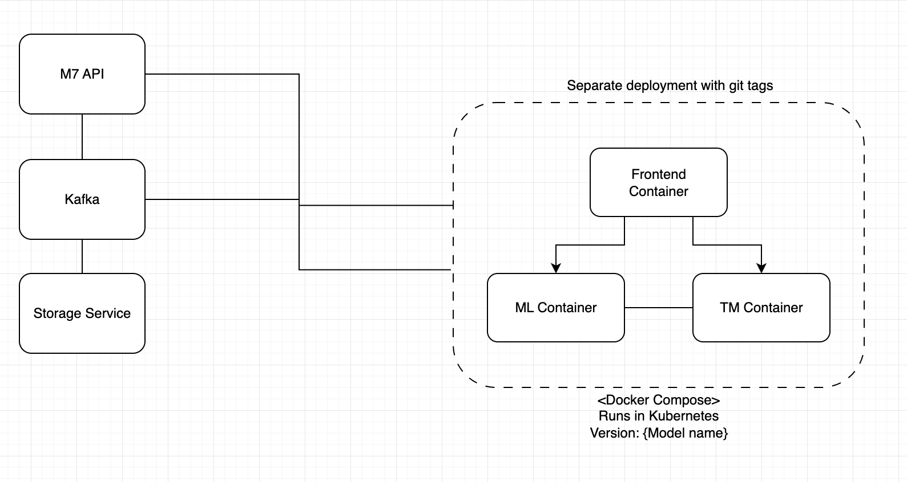

# WIP: t1-algo-registry
Repository and architecture is still exploration mode.
Registry for ML Model and Algotrader deployments.


### Local testing for transformer-v1
```sh
# build docker images with a specific tag
./build.sh --tag transformer0.4.2 
# starting your docker compose file
docker-compose -f models/transformer-v1/compose.yaml up
# the application should run
```

### Git actions
By tagging the `M7` and `T1-Models` git repository with `git tag transformerV0.4.2 && git  push --tags` github actions are triggered to build and push the images to the registry.

### Deploying to Kubernetes
```sh
# generate kubernetes ressources from docker compose
cd models/{model-name}
kompose convert -o ./kubernetes/
kubectl apply -f ./kubernetes/
# deleting from kubernetes
kubectl delete -f ./kubernetes/
```

### Port forwarding for local frontend connection
```sh
# chose the right service name
kubectl port-forward svc/transformer-v1-tm 7001:7001
```

### Kubernetes Dashboard
Create a token to login: `kubectl -n kube-system create token admin-user`
To access Dashboard run:
  `kubectl -n kubernetes-dashboard port-forward svc/kubernetes-dashboard-kong-proxy 8443:443`
Dashboard will be available at: https://localhost:8443

